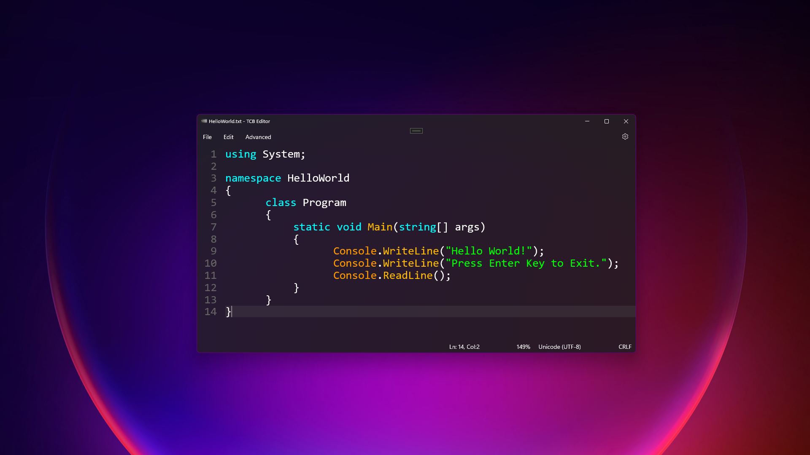
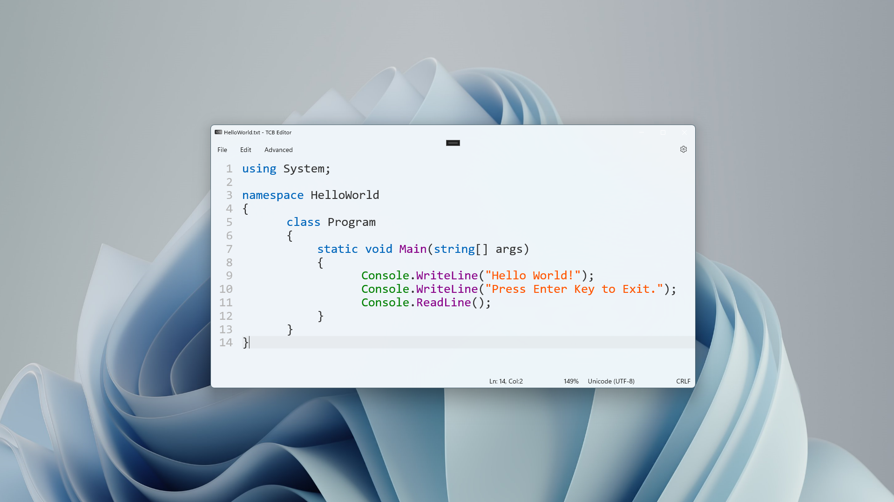

<h1>FluentEdit</h1>

     

### Features:
- Syntax highlighting for Batch, Config file, C++, C#, CSV, CSS, GCode, Hex, Html, Java, Javascript, JSON, Markdown, LaTex, PHP, Python, QSharp, Toml, and XML
- Line numbering
- Line highlighting
- Auto bracket and quotation mark completion
- Outstanding performance
- Packed with useful features
- Quick access panel (Ctrl + Shift + P)
- Background customization (Mica, Acrylic, Static)

### A little replacement for the Windows Editor I tried my very best to match the design of it

