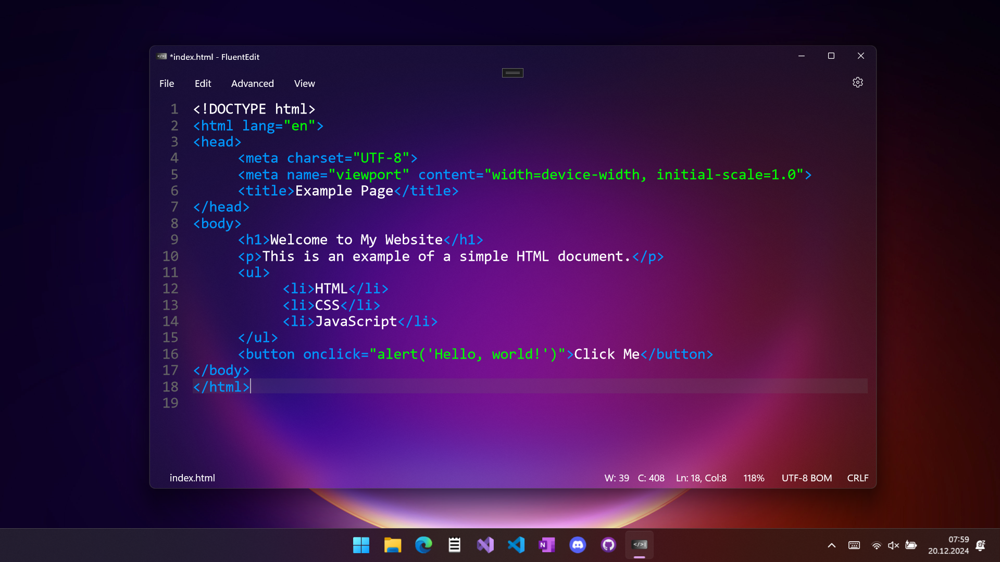
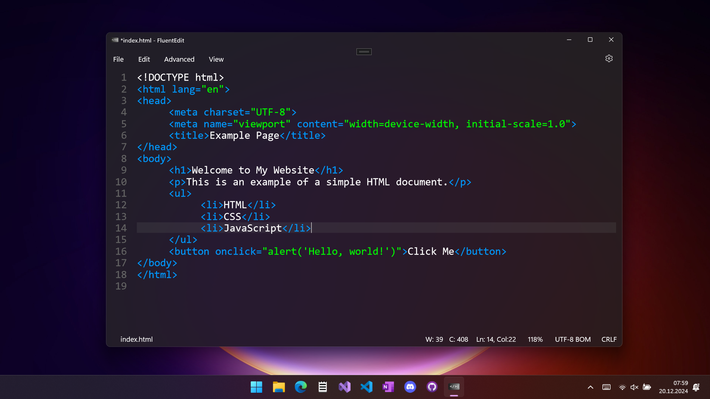
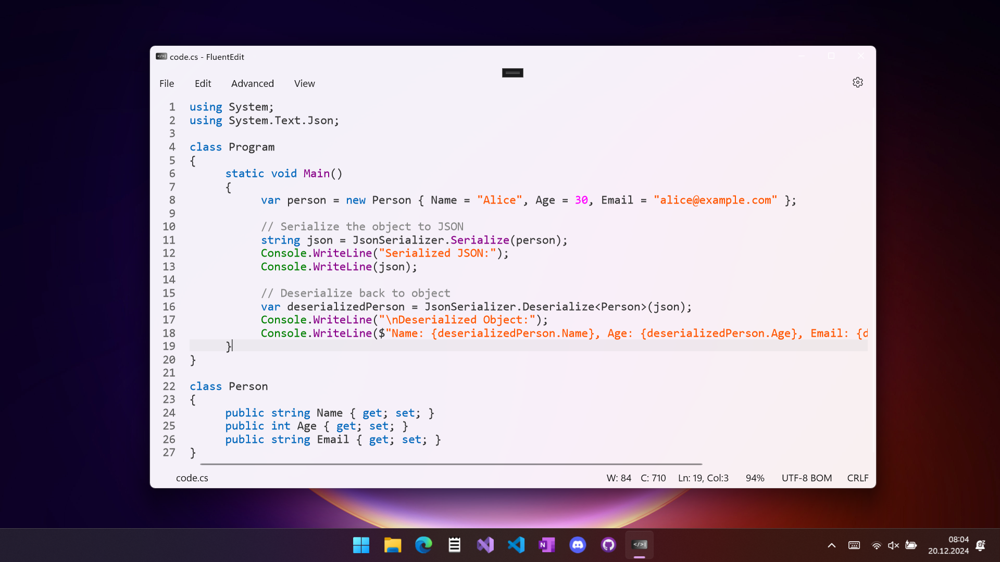

<h1>FluentEdit</h1>

## 📥 Download

## 🔍 Features
- Syntax highlighting for multiple file types, including Batch, Config, C++, C#, CSV, CSS, GCode, Hex, HTML, Java, JavaScript, JSON, Markdown, LaTeX, PHP, Python, QSharp, TOML, and XML.
- Line numbering and line highlighting.
- Auto-completion for brackets and quotation marks.
- High performance, even with large files.
- Packed with useful tools and features.
- Quick access panel (`Ctrl + Shift + P`).
- Customizable backgrounds (Mica, Acrylic, Static).

## Support my work  

## 🚀 Building the project:
To build FluentEdit you need Visual Studio and UWP installed. Then you can clone the repository and open the .sln file with Visual Studio.

## 👨‍👩‍👧‍👦 Contributors:
If you want to contribute to this project, feel free to open an <a href="https://github.com/FrozenAssassine/FluentEdit/issues/new">issue</a> or a <a href="https://github.com/FrozenAssassine/FluentEdit/pulls">pull request</a>.

## 📸 Images

