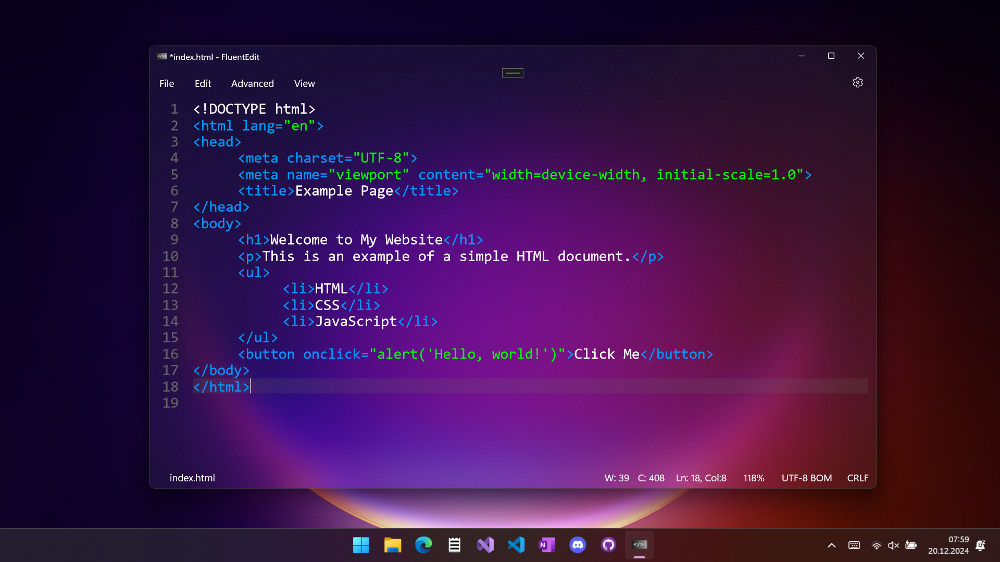
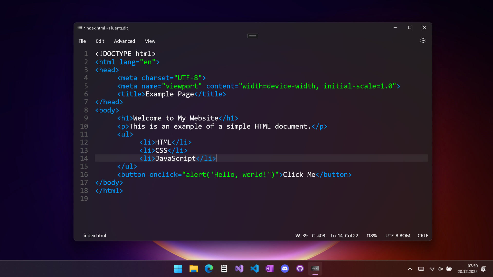
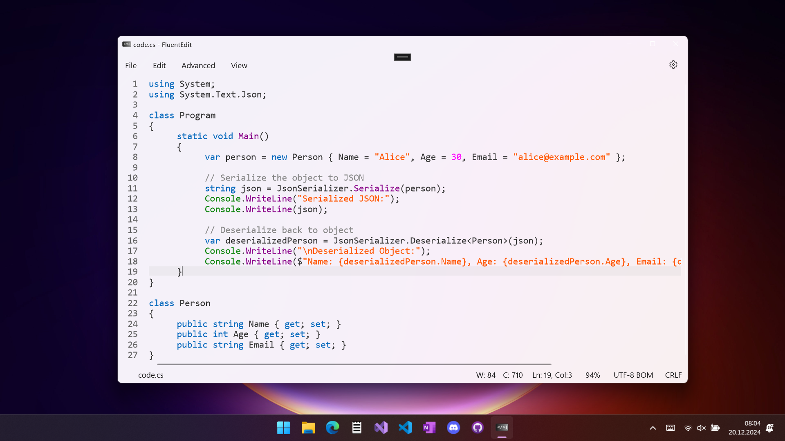

<h1>FluentEdit</h1>

## 📥 Download

## 🔍 Features
- Syntax highlighting for multiple file types, including Batch, Config, C++, C#, CSV, CSS, GCode, Hex, HTML, Java, JavaScript, JSON, Markdown, LaTeX, PHP, Python, QSharp, TOML, and XML.
- Line numbering and line highlighting.
- Auto-completion for brackets and quotation marks.
- High performance, even with large files.
- Packed with useful tools and features.
- Quick access panel (`Ctrl + Shift + P`).
- Customizable backgrounds (Mica, Acrylic, Static).

## Support my work  

## 🚀 Building the project:
To build FluentEdit you need Visual Studio and UWP installed. Then you can clone the repository and open the .sln file with Visual Studio.

## 👨‍👩‍👧‍👦 Contributors:
If you want to contribute to this project, feel free to open an <a href="https://github.com/FrozenAssassine/FluentEdit/issues/new">issue</a> or a <a href="https://github.com/FrozenAssassine/FluentEdit/pulls">pull request</a>.

## How to Contribute a Translation:
1. Create a folder inside the Strings folder of the repository
2. Inside this folder create a folder with the desired [language identifier.](https://learn.microsoft.com/en-us/windows/apps/publish/publish-your-app/msix/app-package-requirements#supported-languages).
3. Inside the folder create a new Resource.resw file or copy the existing english Resource.resw file to translate it directly.
4. Also add an entry for the new language inside the LanguageList.resw.

✅ Editing through Visual Studio directly or VScode using an extension for .resw files is the simplest options

## 📸 Images

